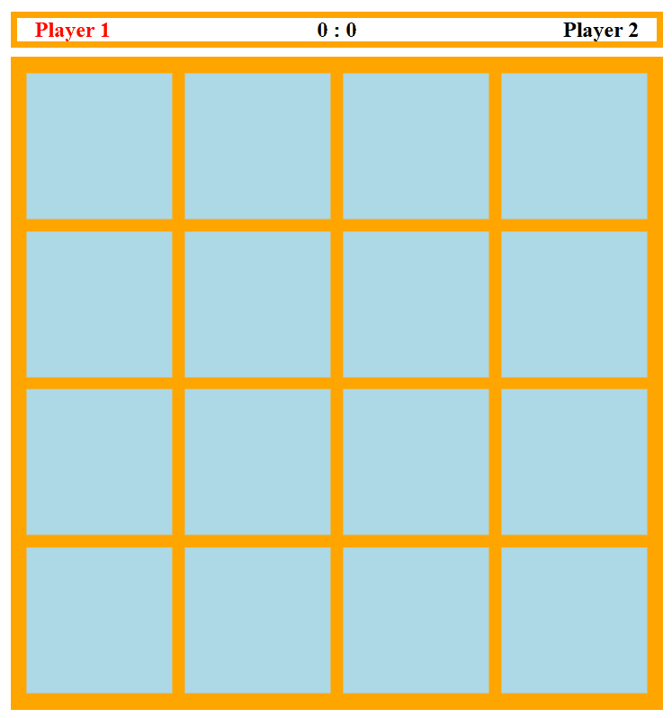

# 🧠 Memory

## Description

This is a fun and interactive memory game built with TypeScript and React.




## Getting Started


Clone, install, run the development server:

```bash

git clone https://github.com/juregvoz/memory

cd memory

npm install

npm run dev
```

Open [http://localhost:3000](http://localhost:3000) with your browser to play.